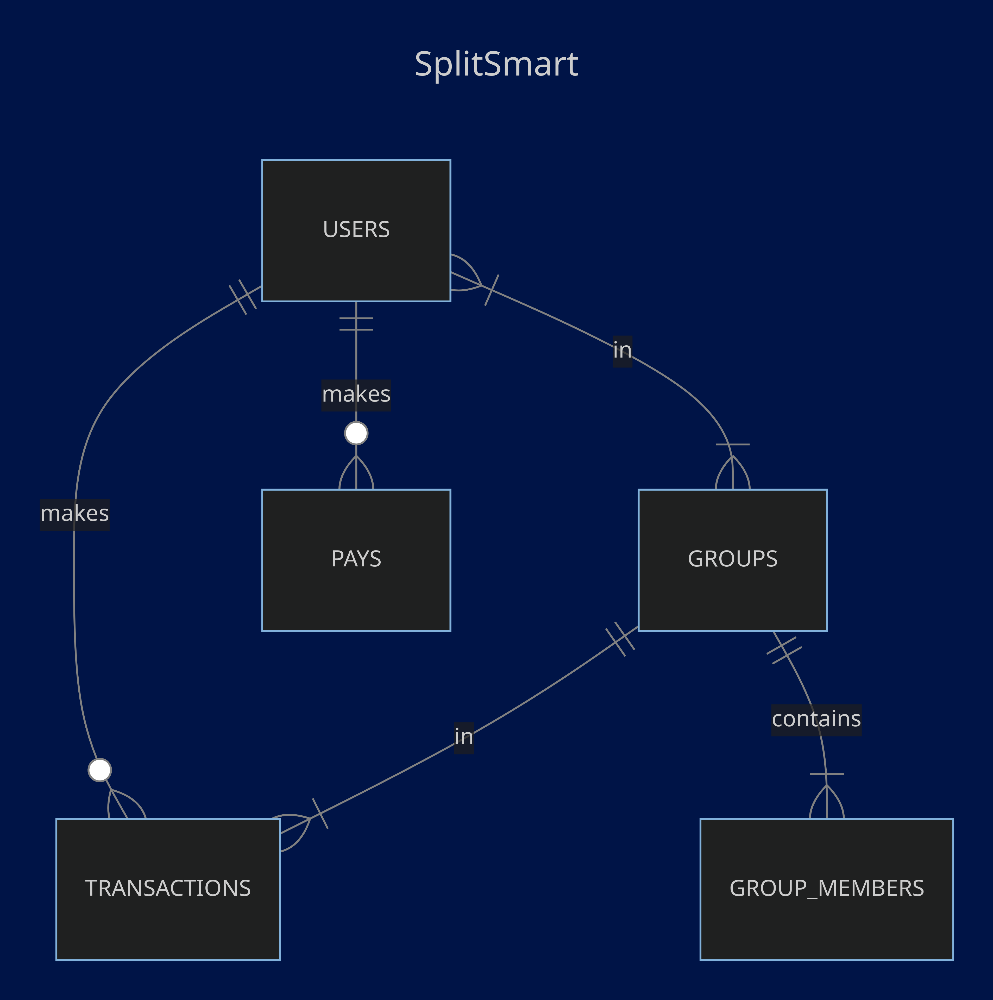

# Design Document

By ALBERTUS MAGNUS MARCELINO ANTAPUTRA

Video overview: <https://youtu.be/9JWbq-Z8C7w>

## Scope

The purpose of this database is to keep track of transactions made by users in a group and calculate how much they owe to one another.

* Which people, places, things, etc. are you including in the scope of your database?
Anyone can use this database.

## Functional Requirements

What should a user be able to do with your database?
- users can create groups and insert other users into groups
- users can insert trasactions and pays
- users can view trasactions, pays, and members in a group
- users can view total_owe

## Representation

### Entities

There are 5 tables in my database.
The users table will have:
- id, which is the ID of the user (type=serial).
- name, which is the name of the user (type=varchar(32)).
The groups table will have:
- id, which is the ID of the group (type=serial).
- name, which is the name of the group (type=varchar(32)).
The group_members table will have:
- id, which is the ID of the row (type=serial).
- member_id, which is the ID of the member of a group (type=int, references users table).
- group_id, which is the ID of the group (type=int, references groups table).
The transactions table will have:
- id, which is the ID of the row (type=serial).
- user_id, which is the ID of the user who made the transaction (type=int, references users table).
- group_id, which is the ID of the group that the transaction is made in (type=int, references groups table).
- amount, which is the amount the user paid for the transaction (type=int).
- timestamp, which is the time and date the user made the transaction (type=timestamp default now()).
The pays table will have:
- id, which is the ID of the row (type=serial).
- payer_id, which is the ID of the user who made the payment (type=int, references users table).
- payee_id, which is the ID of the user who receives the payment (type=int, references users table).
- group_id, which is the ID of the group that the payment is made for (type=int, references groups table).
- amount, which is the amount the user paid (type=int).
- timestamp, which is the time and date the payment was made (type=timestamp default now()).

### Relationships

## Optimizations

Several indexes and views were made for reducing searching time. Indexing is done only on columns that are commonly selected in the common queries that is used in this database for efficiency. Views made: "balibalibali_pays" (lists all the pays made in the group balibalibali), "balibalibali_transactions" (lists all the transactions made in the group balibalibali), and "balibalibali_group_members"(lists all the group members of balibalibali). *balibalibali is the name of the group that is made for demonstration. To view the total owe someone has to another group member, the function total_owe has been made and a query like "SELECT total_owe('theo', 'marcel', 'balibalibali');" can be made to view the owe theo has on the user marcel.

## Limitations

Payments that are not split equally cannot be represented.
